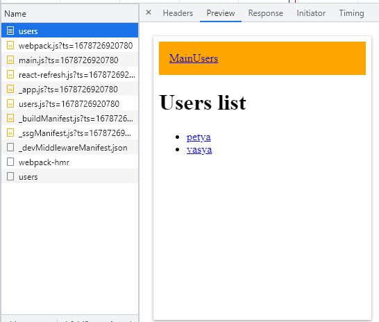
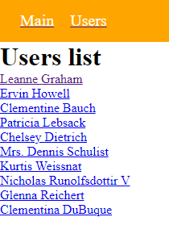
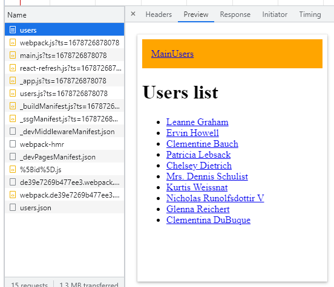

### This project was created without `npx create-next-app`

NextJs wrappers react and its main purpose is to make page to render on server
and send ready html file. This way of creation apps are used because SPA have problems 
with SEO optimization(**Search Engine Optimization**). But now google and yandex claim that
they fixed this problem and search robots can index SPA correctly. 

Initialize our project and install dependecies: 
### `npm init -y`

### `npm install next react react-dom`

In Next you don't have to import react.

Create `pages` folder. Here we will store all of our pages. Each file would be a rout,
so if we create index.js file it would be equal to `/` roure, if users.js - `/users`...

To navigate in NextJs use `Link` component: 

```javascript jsx
    <Link href='/'>Main</Link>
    <Link href='/users'>Users</Link>
```

To make dynamic routes you should wrap file name in `[]` like `[id]`.

Lets create some styles. Create styles folder and try to import this styles into index.js.
You will receive an error, cause to connect styles we need _app.js file. 

`_app.js` is a component, that wrappers all our project. Here we correctly import css files.
Importing css is not only one ability.

To create styles for file you sould name your file like this: `{name}.module.js`. Then you can 
import it in your component. Also next gives an ability to not conflict with other css.
If you give `.module` in your name, next will add prefix and unique hash to your classname.

Now lets connect sass: 

### `npm install sass`

Now we are moving to main features of nextjs - async code. Lets compare default react code,
and code in nextjs: 

```javascript
// React
const [users, setUsers] = useState([])
const makeRequest = async () => {
    const response = await fetch('https://jsonplaceholder.typicode.com/users')
    const data = await response.json();
    setUsers(data)
}
useEffect(()=>{
    makeRequest()
},[])
```

The result of csr is: 



But actually the result is: 



It all because on server we didnt know about users from endpoint.

So what about ssr? To make our http request on server side we can use this functions:
- getStaticProps
- getServerSideProps


## For static route
```javascript
// Next
//in users file 
export async function getStaticProps(context) {
    const response = await fetch('https://jsonplaceholder.typicode.com/users')
    const users = await response.json();

    return {
        props: {users}
    }
}
```

# For dynamic route 

```javascript
// Next
// in users folder [id] file
export async function getServerSideProps(context) {
    const response = await fetch('https://jsonplaceholder.typicode.com/users')
    const user = await response.json();

    return {
        props: {user}
    }
}
```

The result of ssr is:



Actual result:


Meta-tags. To add meta-tags to page we should import `Head` from `next/head` and then
use it in our component. As an example i added meta tag in users page: 

```javascript
<Head>
    <meta keywords='nextjs-snippet next'></meta>
</Head>
```

Create a main wrapper to take out here main components of page. Create MainComponent.js and 
move our code from users to this component: 

```javascript
const MainComponent = ({children, keywords}) => {
    return (
        <>
            <Head>
                <meta keywords={`nextjs-snippet next ${keywords}`}></meta>
                <title>Users page</title>
            </Head>
            <style jsx>
                {`
                    .navbar {
                      background-color: orange;
                      padding: 15px;
                    }
                `}
            </style>
            <div className='navbar'>
                <A href='/' text='Main' />
                <A href='/users' text='Users' />
            </div>
            <div>{children}</div>
        </>
    );
};
```

Handle 404 page. Create 404.js in pages folder and that's it!

```javascript
import React from 'react';

const NotExist = () => {
    return (
        <div>
            Custom not exist page
        </div>
    );
};

export default NotExist;
```

And finally lets deploy next application. Add scripts to package.json:

```json
{
  "scripts": {
    "dev": "next dev",
    "build": "next build", 
    "start": "next start"
  }
}
```

Push your code to github and come to [vercel](https://vercel.com/home). NextJs 
was invented by Vercel, so they also provide a possibility to deploy applications.
Click on `deploy free` button and login in github. Then import your repository from 
list and choose user(it would be your github). In next window you can configurate your
project and then click on `deploy` button. Congratulations, you got the link to your deploy and 
now you can share it.